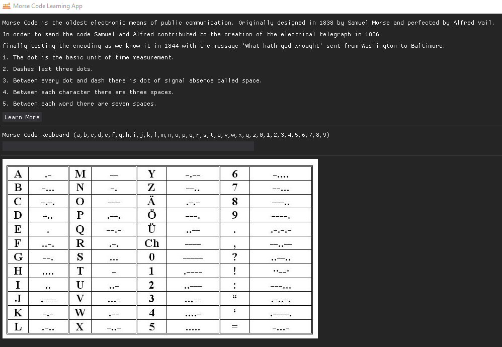

<br />
<div align="center">
  <a href="https://github.com/othneildrew/Best-README-Template">
    
  </a>

  <h3 align="center">Morse Code Learning Desktop Application</h3>

  <p align="center">
    This is old encoding technology and it's fascinating to learn about it.
  </p>
</div>

## Installation

To run the python script:

1. Clone the repo
   ```sh
   git clone https://github.com/DarioArzaba/MorseCodeDesktop
   cd MorseCodeDesktop
   ```
2. Install python requirements
   ```sh
   pip install -r requirements.txt
   ```
3. Run the `main.py` file
   ```js
   python main.py
   ```

To create a win binary using `pyinstaller`:

1. Clone the repo
   ```sh
   git clone https://github.com/DarioArzaba/MorseCodeDesktop
   cd MorseCodeDesktop
   ```
2. Install python requirements
   ```sh
   pip install -r requirements.txt
   ```
3. Run pyinstaller
   ```sh
   pyinstaller --hidden-import=_cffi_backend .\main.py
   ```
4. Copy the `img` and `mp3` folders into `MorseCodeDesktop\dist\main`
5. Open a terminal at the `MorseCodeDesktop\dist\main`and run the executable
   ```sh
   .\main.exe
   ```

## Usage

Press a sequence of keys to hear their representation in Morse Code.



## Roadmap

- [x] Add Text to Morse Code keyboard
- [ ] Generate Morse Code to Text exercises
- [ ] Disable sections of the program with checkbox
- [ ] Use `Tree` to copy the media folders automatically

## License

Distributed under the [MIT License](https://mit-license.org/).

## Contact

Dario Arzaba - dario.arzaba@gmail.com